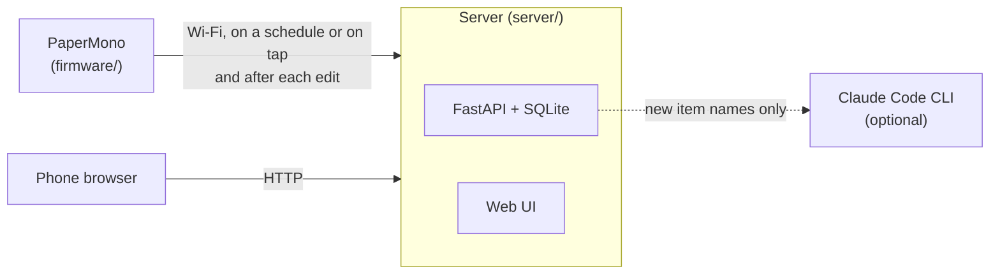

# PaperMono Shopping List

Firmware for the [M5Stack PaperMono](https://docs.m5stack.com/en/core/PaperMono)
e-paper device. It turns the device into a household shopping list that lives on
the fridge and stays in sync with a phone web app.

<p align="center">
  
  &nbsp;&nbsp;
  
</p>

The PaperMono is an ESP32-S3 with a 3.97" 480×800 e-paper touchscreen. This
project is a complete, working app for it that's small enough to read: about
2,400 lines of C++. You can use it as a shopping list, or as a starting point
for your own PaperMono firmware.

## What it shows on the PaperMono

- **E-paper refreshes handled properly.** Taps, scrolling and typing use fast
  partial updates with no flash. A full refresh is forced after every 10
  partial updates to keep ghosting down and protect the panel. Greys are drawn
  as 1-bit dot patterns, so they look the same under both refresh modes.
- **A usable touch UI on e-paper.** Tap, swipe and the side buttons all work.
  There's an on-screen keyboard that only redraws the parts that change as you
  type, and it suggests items you've added before.
- **Low-power networking.** Wi-Fi is on only while syncing: on a schedule you set
  in the web UI (say, nothing overnight and more often at weekends), sooner
  if you tap the screen and the last sync is more than 5 minutes stale, and
  straight after an edit. Everything else works offline, and edits are queued
  on flash until the next sync.
- **Light sleep.** Between syncs the CPU sleeps and the panel keeps showing the list. A timer wakes
  it for each sync; the side keys, the power button and a touch wake it for use.
- **Tidy power handling.** Power-button shutdown, with a deep-sleep fallback for
  when USB power stops the power IC switching off. The device turns itself off
  at a safe battery voltage. The frontlight is off by default.
- **Documented bring-up.** The power IC, IO expander, panel and touch controller
  are brought up in a known-good order.
  [docs/hardware.md](docs/hardware.md) has the pin map, I²C addresses and the
  quirks found along the way.

## How it works

The device shows the list grouped by aisle, in the order you walk the shop. Tap
an item to tick it off, or add one with the on-screen keyboard. Everyone else
adds things from their phone.

<p align="center">
  
  &nbsp;&nbsp;
  
</p>

A small server in between stores the list. It remembers which aisle every item
belongs to and can optionally sort brand-new items into the right aisle with
Claude.



- **Grouped by aisle, in walking order.** You set the aisle order once from the
  phone, and both screens follow it.
- **Works offline.** The list, suggestions, ticking off and adding all work
  without a connection, including in a shop with no signal.
- **Remembers your items.** Every name you've added goes into a catalog that
  drives suggestions on both the device and the phone.
- **Optional auto-sorting.** The first time the server sees a name, it can send
  it to Claude to file it under an aisle. If you move an item to a different
  aisle by hand, that correction sticks.

## Repository layout

```
firmware/   PlatformIO project for the PaperMono (C++ / Arduino)
server/     FastAPI server, SQLite store, phone web UI, tests
docs/       Hardware notes, architecture, API, build and deploy guides, design notes
```

## Quick start

### 1. Run the server

```sh
cd server
python3 -m venv .venv && .venv/bin/pip install -e .
SHOPPING_LIST_CLASSIFIER=none .venv/bin/uvicorn shopping_list.main:app --host 0.0.0.0 --port 8000
```

Open `http://<server-ip>:8000/` on your phone, tap **Aisles**, and add your shop's
aisles in the order you walk them. See [docs/server.md](docs/server.md) for
systemd and Docker deployment and for turning on auto-sorting.

### 2. Build and flash the firmware

You need [PlatformIO](https://platformio.org/) and a PaperMono connected over USB-C.

```sh
cd firmware
cp src/secrets.example.h src/secrets.h   # set Wi-Fi SSID/password and the server URL
pio run -t upload
```

> **Back up your device's flash before the first flash.** It holds that unit's
> factory calibration data. [docs/firmware.md](docs/firmware.md) covers the backup,
> download mode and flashing from a browser.

## Documentation

| Doc | What's in it |
|-----|--------------|
| [Hardware notes](docs/hardware.md) | Pin map, I²C devices, bring-up sequence, display, touch and power details; reusing the drivers |
| [Firmware](docs/firmware.md) | Building, configuring, flashing and recovering the device; using it; troubleshooting |
| [Architecture](docs/architecture.md) | Components, data model, the sync protocol, offline behaviour, display refresh policy |
| [Server](docs/server.md) | Running and deploying the server, configuration, auto-sorting, security |
| [HTTP API](docs/api.md) | Every endpoint, request and response |
| [Design notes](docs/design-notes.md) | Where the firmware came from, decisions and trade-offs, known limitations |

## Status

A personal project, running on one device at home. It works, but it isn't a
product. There's no on-device Wi-Fi setup (credentials are compiled in), no
authentication on the server (keep it on your LAN or behind an authenticating
reverse proxy), and only the PaperMono **C153** has been tested. See
[known limitations](docs/design-notes.md#known-limitations).

## Author

Built by Seamus Cawley, who builds [Bronto](https://bronto.io), the logging and
observability platform, by day.

## Credits

The firmware's board support, e-paper and touch drivers, keyboard layout and
widget style are adapted from [MonoMesh](https://github.com/andrecolz/MonoMesh) by
andrecolz, an independent Meshtastic-compatible firmware for the same hardware.
[docs/design-notes.md](docs/design-notes.md#provenance) lists exactly what was
reused.

## License

[GNU General Public License v3.0](LICENSE), the same license as MonoMesh, which
parts of the firmware derive from.
